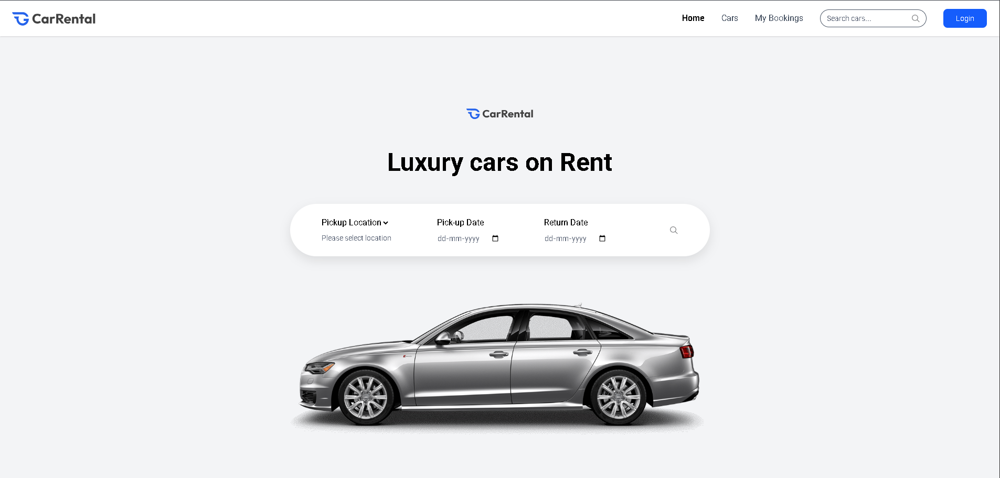
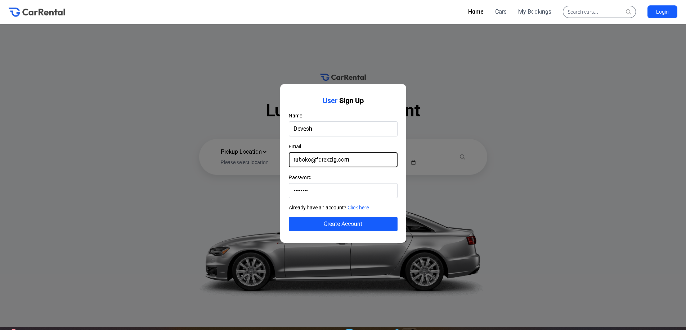
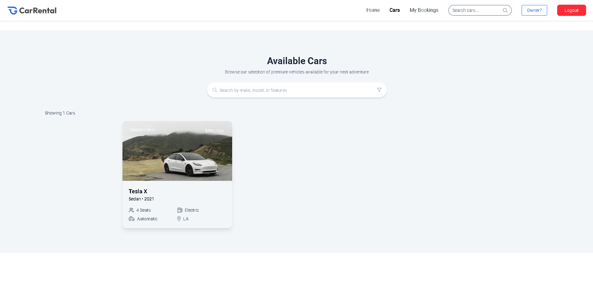
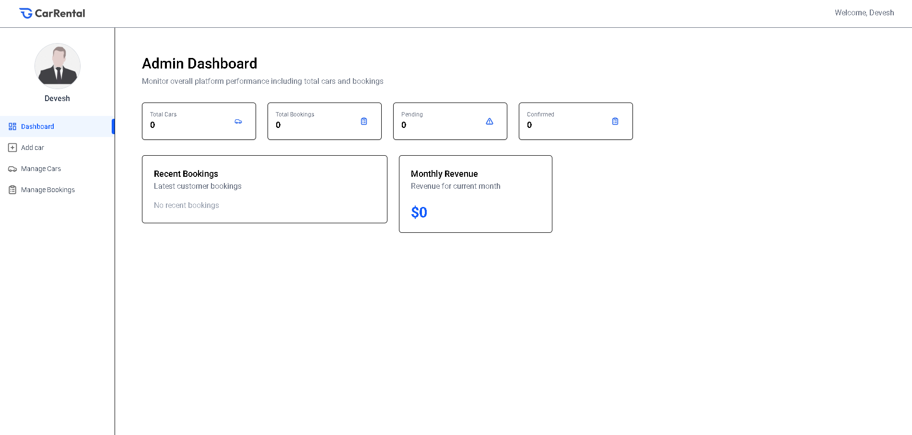

Car Rental Platform

A full-stack web application for browsing, booking, and managing car rentals. Built with Next.js, TypeScript, and TailwindCSS, featuring user registration, authentication (JWT), role-based access control, and car listings.

Deployed on Vercel → Live Demo

🚀 Features

User registration and login with JWT-based authentication

Role-based access (user, owner/admin)

Browse and search available cars

Add and manage car listings (for owners)

Responsive UI with TailwindCSS

Deployment on Vercel

🛠 Tech Stack

Frontend: Next.js, TypeScript, TailwindCSS

Backend: Next.js API Routes, Node.js, Express.js (if included)

Authentication: JWT, OAuth (if you’ve implemented it)

Database: PostgreSQL with Prisma ORM

Deployment: Vercel

📦 Installation

Clone the repository:

git clone https://github.com/devanshjhaa/car-rental.git
cd car-rental

Install dependencies:

npm install
# or
yarn install

Set up environment variables in .env:

DATABASE_URL=your_postgres_url
JWT_SECRET=your_secret

Run the development server:

npm run dev

Open http://localhost:3000
 in your browser.
## 📸 Screenshots  

### Homepage  
  

### User Sign-Up  
  

### Car Listings  
  

### Admin Dashboard  
  

